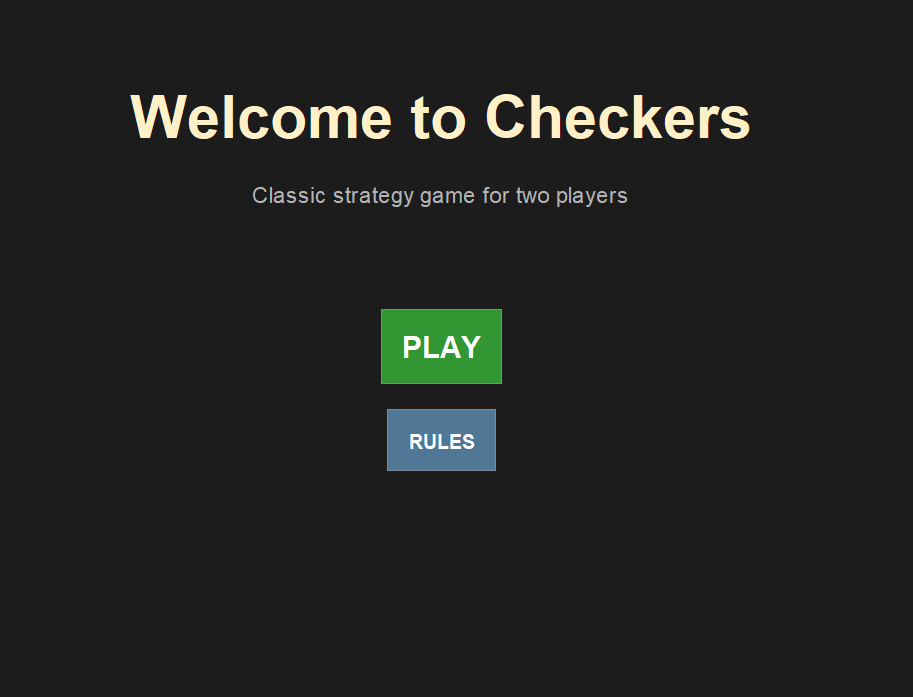
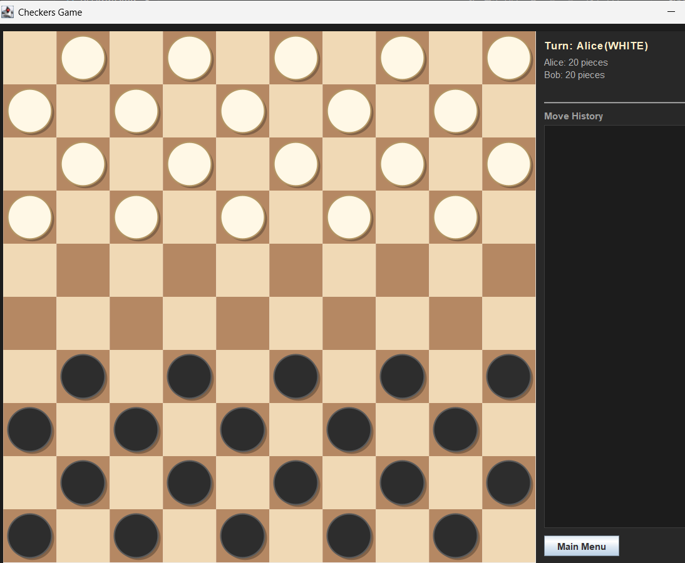

project : Checkers
this project is a Checker game, coded in Java, using POO principles.

# GUI justification
we used Swing for GUI because it is already implemented in java, and easy to use. we were first going to us java FX, but decided to go back to swing, judging it would take too much time to learn how to use it and add it.
using an implemented tool was the logical choice for it.


# Compilation

```bash
javac -d bin src/model/*.java src/view/*.java
```

This command compiles all Java source files and places compiled classes in the `bin/` directory.

# Execution

```bash
java -cp bin view.GUI
```

This launches the graphical game interface.

# Project Structure

```
Dames/
├── src/
│   ├── model/          # Game logic and data structures
│   │   ├── Game.java       # Main game controller
│   │   ├── Board.java      # Board state and rules
│   │   ├── Player.java     # Player tracking
│   │   ├── Piece.java      # Base piece class
│   │   ├── Pion.java       # Regular pawn piece
│   │   ├── Dame.java       # King/dame piece
│   │   ├── Move.java       # Move recording
│   │   ├── Square.java     # Board square
│   │   └── GameVariant.java # Game variant enumeration
│   └── view/           # GUI and visualization
│       ├── GUI.java            # Main window and navigation
│       ├── MenuPanel.java      # Main menu screen
│       ├── VariantSelectorPanel.java  # Game variant selection
│       ├── PlayerSetupPanel.java      # Player name input
│       ├── GameScreenPanel.java       # Main game display with scoreboard
│       ├── BoardPanel.java     # Board rendering and click handling
│       └── RulesDialog.java    # Rules display window
└── bin/                # Compiled Java classes
```

# Architecture

## Design Pattern: MVC (Model-View-Controller)

- **Model Layer** (`src/model/`): Manages game state, rules, and piece logic
- **View Layer** (`src/view/`): Handles all GUI rendering and user interaction
- **Controller**: `GUI.java` coordinates navigation between screens

## Key Classes

**Model:**
- `Game`: Orchestrates game flow, validates moves, checks win conditions
- `Board`: Maintains 10×10 grid, manages piece placement and movement
- `Piece` (abstract): Base class for `Pion` and `Dame` with specialized movement rules
- `Player`: Tracks pieces, dames, and player name

**View:**
- `GUI`: CardLayout-based multi-screen navigation system
- `BoardPanel`: Renders board with dynamic scaling, handles click detection
- `GameScreenPanel`: Combines board and scoreboard with real-time updates
- `MenuPanel`, `VariantSelectorPanel`, `PlayerSetupPanel`: Screen-specific UI

## How to Play

1. **Start Game**: Click "PLAY" on the main menu or click "RULES" to learn the rules first
2. **Select Variant**: Choose between International (10×10) or English (8×8)
3. **Enter Names**: Customize player 1 and player 2 names (defaults: Alice and Bob)
4. **Click to Move**: 
   - Click a piece to select it (highlights in green)
   - Valid moves appear as green circles
   - Click a destination to move
   - Jump over opponent pieces to capture them
5. **Automatic Promotion**: Pieces reaching the opposite end become dames (can move/capture backward)
6. **Win Condition**: Capture all opponent pieces or force them into a no-move position to win

## Controls

- **Left Mouse Click**: Select piece or move destination
- **Window Resize**: Drag edges to resize window; board scales proportionally
- **Main Menu**: Click "Main Menu" button during game to return to start screen

## Two Game Variants
  - International Checkers (10×10 board, 20 pieces per player)
  - English Draughts (8×8 board, 12 pieces per player)

## Game Rules Summary

- Players alternate turns with White moving first
- Pieces move diagonally (pawns forward, dames any direction)
- Capture by jumping over an opponent's piece onto empty square
- Chain captures are mandatory when available
- Pieces become dames upon reaching the opposite end
- Win by capturing all opponent pieces 


